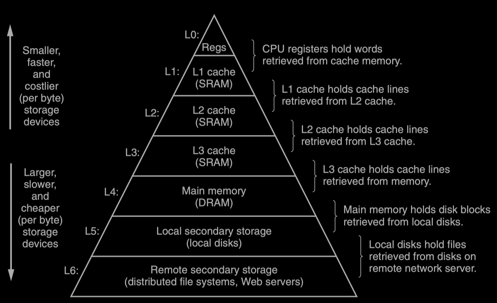

# Chapter 1: A Tour of Computer System

## 1.5 Caches Matter

* An important lesson from this simple example is that a system spends a lot of time moving information from one place to another. 
  * The machine instructions in the hello program are originally stored on disk. 
  * When the program is loaded, they are copied to main memory. 
  * As the processor runs the program, instructions are copied from main memory into the processor. 
  * Similarly, the data string 'hello,world\n', originally on disk, is copied to main memory and then copied from main memory to the display device.
* Some truths about processor-memory gap:
  * Larger storage devices are slower than smaller storage devices.
  * Faster devices are more expensive to build than their slower counterparts.
  * a typical register file stores only a few hundred bytes of information, as opposed to billions of bytes in the main memory.
  * Processor can read data from the register file almost 100 times faster than from memory. 

* To deal with the processor–memory gap, system designers include smaller, faster storage devices called ==cache== memories.
  * ==L1 cache (SRAM - static random access memory: 静态随机存取存储器)== - holds tens of thousands of bytes and can be accessed nearly as fast as the register file.
  * ==L2 cache (SRAM - static random access memory: 静态随机存取存储器)== - hundreds of thousands to millions of bytes is connected to the processor by a special bus. 5 times slower than L1 cache but 5-10 times faster than main memory.

## 1.6 Storage Devices Form a Hierarchy

* The main idea of a memory hierarchy is that storage at one level serves as a ==cache== for storage at the next lower level.
  * the register file is a cache for the L1 cache. 
  * Caches L1 and L2 are caches for L2 and L3. 
  * The L3 cache is a cache for the main memory, which is a cache for the disk. 
  * On some networked systems with distributed file systems, the local disk serves as a cache for data stored on the disks of other systems.

