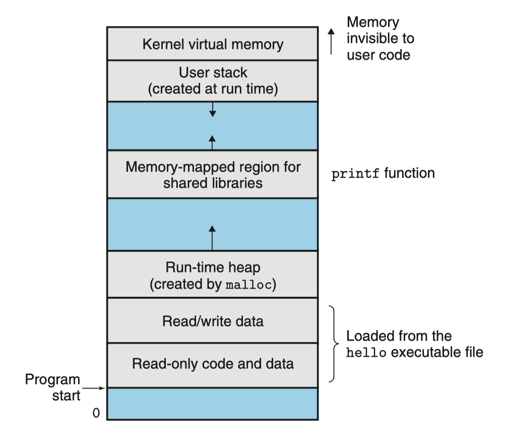

# Chapter 1: A Tour of Computer System

## 1.7 The Operating System Manages the Hardware

#### Who manages hardware

* When the shell loaded and ran the hello program, and when the hello program printed its message, neither program accessed the keyboard, display, disk, or main memory directly. Rather, they relied on the ==services== provided by the ==operating system==. 

#### How OS manages hardware generally

* 2 primary purposes of OS:

  * Protect the hardware from misuse by runaway applications.

  * Provide applications with ==simple and uniform mechanisms== for manipulating complicated and often wildly different low-level hardware devices.

* Layered view of a computer system:

  

  * We can think of the operating system as a layer of software interposed between the application program and the hardware.
  * All attempts by an application program to manipulate the hardware must go through the operating system.

* The operating system achieves both goals via the fundamental abstractions:

  

  * Files are abstractions for I/O devices.
  * Virtual memory is an abstraction for both the main memory and disk I/O devices.
  * Processes are abstractions for the processor, main memory, and I/O devices. 

### 1.7.1 Processes

#### 1. What is a process?

* When a program such as hello runs on a modern system, the operating system provides the illusion that the program is the ==only one== running on the system. 
* The illusion is like:
  * The program appears to have ==exclusive use== of both the processor, main memory, and I/O devices.
  * The code and data of the program appear to be the only objects in the system’s memory. 
* A ==process== is the operating system’s abstraction for a running program.
  * Multiple processes can run ==concurrently== on the same system, and each process appears to have exclusive use of the hardware.
  * By concurrently, we mean that the instructions of one process are ==interleaved== with the instructions of another process.
  * A single CPU can appear to execute multiple processes concurrently by having the processor switch among them. The operating system performs this interleaving with a mechanism known as ==context switching==.

#### 2. What is process context switching

* ==Context== 
  * The operating system keeps track of all the state information that the process needs in order to run, which is known as the context.
  * The context includes information such as the current values of the PC, the register file, and the contents of main memory.

* ==Context switching==

  * At any point in time, a uniprocessor system can only execute the code for a single process.

  * When the operating system decides to transfer control from the current process to some new process, it performs a ==context switch== by **saving the context of the current process, restoring the context of the new process, and then passing control to the new process**.
  
  * The new process picks up exactly where it left off.


* Preparation:

  * The transition from one process to another is managed by the operating system ==kernel==. The kernel is the portion of the operating system code that is **always resident in memory**.
  * When an application program requires some action by the operating system, such as to read or write a file, it executes a special ==system call== instruction, transferring control to the kernel.
  * The kernel then performs the requested operation and returns back to the application program.
  * the kernel is not a separate process. Instead, it is a collection of code and data structures that the system uses to manage all the processes.

* Example (the shell process and the hello process):

  * Initially, the shell process is running alone, waiting for input on the command line.
  * When we ask it to run the hello program, the shell carries out our request by invoking a special function known as ==a system call== that passes control to the operating system.
  * The operating system **saves the shell’s context**, creates a new hello process and its context, and then passes control to the new hello process.
  * After hello terminates, the operating system **restores the context of the shell process** and passes control back to it, where it waits for the next command-line input.

  

### 1.7.2 Threads

* Although we normally think of a process as having a single control flow, in modern systems a process can actually consist of multiple execution units, called ==threads==, **each running in the context of the process and sharing the same code and global data**.


### 1.7.3 Virtual Memory

#### 2 basic concepts:

* ==Virtual memory== is an abstraction that provides each process with the illusion that it has **exclusive use of the main memory**.
* Each process has the same uniform view of memory, which is known as its ==virtual address space==.

#### Layout of virtual address space

* Example of virtual address space for Linux processes:

  

  * In Linux, the topmost region of the address space is reserved for code and data in the operating system that is **common to all processes**.
  * The lower region of the address space holds the code and data defined by the **user’s process**.

* Some concepts from bottom to top:
  * Program code and data
    * Code locations begin at the same fixed address for all processes.
    * Data locations begin after code locations that correspond to global C variables. 
    * The code and data areas are initialized directly from the contents of an executable object file.
  * Heap
    * The code and data areas are followed immediately by the ==run-time heap==.
    * Unlike the code and data areas, which are fixed in size once the process begins running, the heap **expands and contracts dynamically at run time** as a result of calls to C standard library routines such as malloc and free.
  * Shared libraries
    * Near the middle of the address space is an area that holds the code and data for ==shared libraries== such as the C standard library and the math library.
  * Stack
    * At the top of the user’s virtual address space is the user stack that the compiler uses to implement function calls.
      * Each time we call a function, the stack grows. 
      * Each time we return from a function, the stack contracts (缩小).
  * Kernel virtual memory
    * The top region of the address space is reserved for the kernel. 
    * Application programs are not allowed to read or write the contents of this area or to directly call functions defined in the kernel code.
* A good example:

```c
int a = 0; 	//全局初始化区 
char *p1; 	//全局未初始化区 
main() 
{ 
	int b;// 栈 
	char s[] = "abc"; //栈 
	char *p2; //栈 
	char *p3 = "123456"; 123456/0";//在常量区，p3在栈上。 
	static int c =0； //全局（静态）初始化区 
	p1 = (char *)malloc(10); 
	p2 = (char *)malloc(20); 
	//分配得来得10和20字节的区域就在堆区。 
	strcpy(p1, "123456"); //123456/0放在常量区，编译器可能会将它与p3所指向的"123456"优化成一个地方。 
}  
```


### 1.7.4 Files

* A file is **a sequence of bytes**, nothing more and nothing less.
* **Every I/O device**, including disks, keyboards, displays, and even networks, is modeled as a file.
  * All input and output in the system is performed by reading and writing files, using a small set of system calls known as Unix I/O.
* This simple and elegant notion of a file is nonetheless very powerful because it provides applications with a uniform view of all the varied I/O devices that might be contained in the system. 


